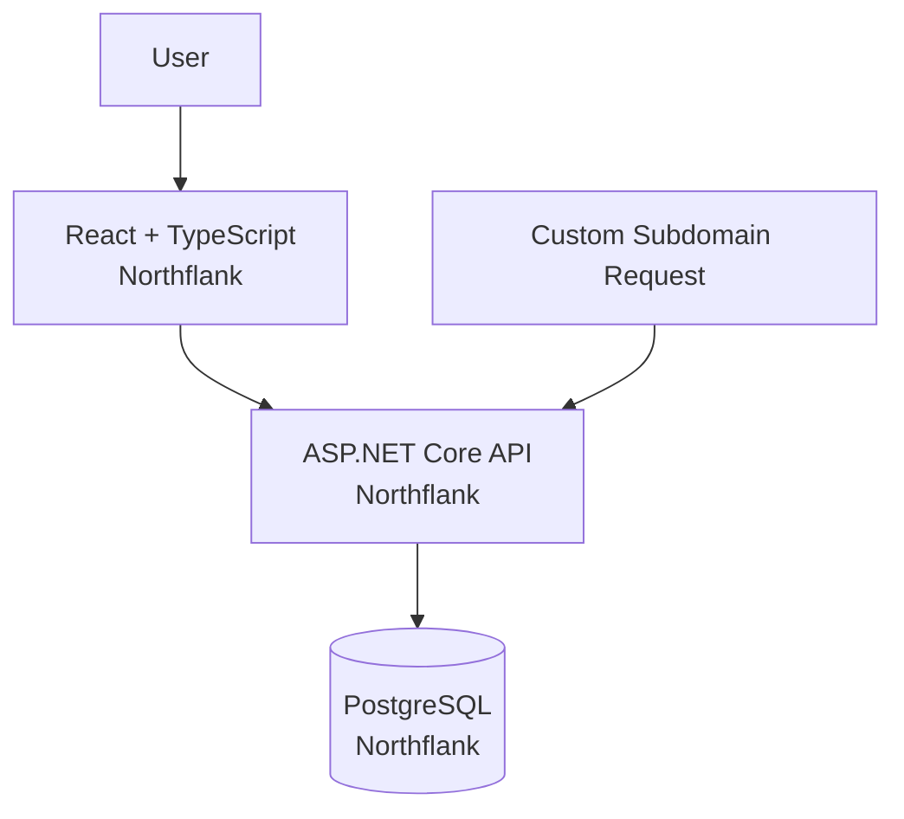

# URL Shortener & Analytics

A full-stack URL shortener and analytics application built with **ASP.NET Core, React, TypeScript, PostgreSQL, and Entity Framework Core**.

The application supports subdomain-based redirects and records analytics for each visit.

## Live Application

**Website:**  
https://www.pablomendoza.site

Example redirects:

```text
git.pablomendoza.site
→ https://github.com/Pablofmv

me.pablomendoza.site
→ https://www.pablomendoza.site

info.pablomendoza.site
→ https://www.pablomendoza.site

ld.pablomendoza.site
→ LinkedIn
```

Analytics dashboard:

```text
https://www.pablomendoza.site/dashboard
```

---

## Architecture



Production request flow:

```text
www.pablomendoza.site
        ↓
React + TypeScript
        ↓
api.pablomendoza.site
        ↓
ASP.NET Core
        ↓
PostgreSQL
```

---

## Tech Stack

### Backend

- C#
- ASP.NET Core
- Entity Framework Core
- LINQ
- PostgreSQL
- REST APIs

### Frontend

- React
- TypeScript
- Vite
- CSS

### Infrastructure

- Northflank
- Custom domains
- HTTPS
- GitHub CI/CD
- Environment-based configuration
- Automatic deployment

---

## Features

### Subdomain Redirects

The backend reads the incoming host, identifies the subdomain, retrieves its destination from PostgreSQL, and redirects the request.

Example:

```text
git.pablomendoza.site
        ↓
ASP.NET Core
        ↓
PostgreSQL lookup
        ↓
https://github.com/Pablofmv
```

### Click Analytics

Each redirect records information including:

- UTC timestamp
- IP address
- Referrer
- User agent
- Country
- State/Region
- ISP/Organization
- Bot vs. human classification
- Subdomain

### Analytics Dashboard

The React dashboard retrieves analytics from the ASP.NET Core API and displays:

- Unique visitors
- Traffic by subdomain
- Unique visitors during the last five days

---

## API

### Unique Visitors

```http
GET /analytics/unique-visitors
```

Returns the number of unique visitors based on distinct IP addresses.

### Unique Visitors — Last 5 Days

```http
GET /analytics/unique-visitors-last-5-days
```

Returns unique visitor counts for the current UTC day and previous four days.

### Traffic by Subdomain

```http
GET /analytics/total-by-subdomain
```

Returns the total number of recorded visits grouped by subdomain.

---

## Database

The application uses PostgreSQL with Entity Framework Core.

Main entities:

```text
Link
├── Id
├── Subdomain
└── DestinationUrl
```

```text
ClickEvent
├── Id
├── Timestamp
├── IpAddress
├── Referrer
├── Country
├── Region
├── ISP / Organization
├── UserAgent
├── IsBot
└── Subdomain
```

Entity Framework migrations are used to manage schema changes.

---

## Production Deployment

The frontend, backend, and PostgreSQL database are deployed independently on Northflank.

```text
GitHub
   ↓
Automatic deployment
   ↓
Northflank
   ├── React frontend
   ├── ASP.NET Core backend
   └── PostgreSQL
```

Production configuration includes:

- HTTPS
- Custom domains
- Production CORS
- Environment variables
- PostgreSQL connection configuration
- EF Core migrations
- Automatic redeployment from GitHub

---

## What I Built

This project demonstrates practical experience with:

- Designing REST APIs with ASP.NET Core
- Working with relational databases and Entity Framework Core
- Building React + TypeScript frontends
- Connecting frontend and backend applications
- Tracking application analytics
- Handling subdomain-based routing
- Managing production configuration
- Deploying a full-stack application
- Using GitHub-based CI/CD
